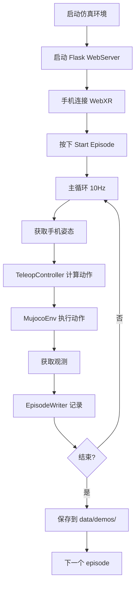
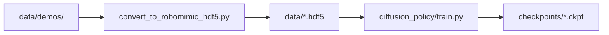
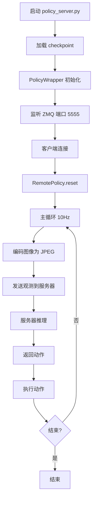

# Bobacbot 项目结构与逻辑链路文档

## 目录
1. [项目概述](#项目概述)
2. [系统架构](#系统架构)
3. [核心模块详解](#核心模块详解)
4. [完整数据流程](#完整数据流程)
5. [文件结构说明](#文件结构说明)
6. [关键代码解析](#关键代码解析)
7. [使用指南](#使用指南)

---

## 项目概述

### 背景
本项目基于斯坦福大学的 **TidyBot2** 开源项目（https://github.com/jimmyyhwu/tidybot2），这是一个全向移动机械臂平台，用于移动操作任务的模仿学习研究。

### 主要改动
相比原版 tidybot2，本项目做了以下关键修改：

1. **底盘更换**：从原版改为 **bobac3** 全向移动底盘
   - 3自由度：x, y, yaw（平面内的位置和朝向）
   - 支持全向移动（holonomic motion）

2. **机械臂更换**：从 Kinova Gen3（7自由度）改为 **eco65b**（6自由度）
   - 6个旋转关节
   - 末端有效载荷能力较好
   - 配置文件：`models/eco65b/eco65b.xml`

3. **夹爪保留**：Robotiq 2F85 两指夹爪
   - 并联机构设计
   - 单个执行器控制

4. **任务目标**：在 MuJoCo 仿真环境中，通过手机遥操作采集演示数据，训练 Diffusion Policy 模型，实现抓取等移动操作任务

### 技术栈
- **物理仿真**：MuJoCo 
- **模仿学习**：Diffusion Policy（扩散策略）
- **逆运动学**：基于雅可比矩阵的阻尼最小二乘法
- **轨迹生成**：Ruckig（在线轨迹生成器）
- **遥操作界面**：WebXR（手机AR/VR接口）
- **通信协议**：
  - 多进程：共享内存（SharedMemory）
  - 网络：ZMQ（策略服务器）、WebSocket（手机遥操作）

---

## 系统架构

### 整体架构图

```
┌─────────────────────────────────────────────────────────────────┐
│                        系统整体架构                               │
├─────────────────────────────────────────────────────────────────┤
│                                                                 │
│  ┌──────────┐         ┌──────────────────────────────┐        │
│  │   手机    │◄────────┤   Flask WebSocket Server    │        │
│  │ WebXR UI │  WiFi   │   (policies.py)              │        │
│  └──────────┘         └──────────────────────────────┘        │
│                                  │                             │
│                                  │ 控制命令                      │
│                                  ▼                             │
│         ┌────────────────────────────────────────┐            │
│         │        主控制循环 (main.py)             │            │
│         │  - run_episode()                       │            │
│         │  - TeleopPolicy / RemotePolicy         │            │
│         └───────────┬────────────────────────────┘            │
│                     │                                          │
│          action     │     observation                          │
│                     ▼                                          │
│         ┌────────────────────────────────────────┐            │
│         │    MuJoCo 仿真环境 (mujoco_env.py)     │            │
│         │                                         │            │
│         │  ┌──────────────────────────────────┐  │            │
│         │  │  物理仿真进程 (MujocoSim)         │  │            │
│         │  │  - BaseController (底盘)         │  │            │
│         │  │  - ArmController (机械臂)        │  │            │
│         │  │  - 控制回调 (10Hz)               │  │            │
│         │  └──────────┬───────────────────────┘  │            │
│         │             │ 共享内存                  │            │
│         │             ▼                           │            │
│         │  ┌──────────────────────────────────┐  │            │
│         │  │  渲染线程 (Renderer)              │  │            │
│         │  │  - 离屏渲染相机图像                │  │            │
│         │  │  - 多相机支持                     │  │            │
│         │  └──────────────────────────────────┘  │            │
│         └────────────────────────────────────────┘            │
│                     │                                          │
│                     │ 保存数据                                  │
│                     ▼                                          │
│         ┌────────────────────────────────────────┐            │
│         │   数据存储 (episode_storage.py)        │            │
│         │   - 每个episode存为独立目录             │            │
│         │   - 图像存为MP4视频                    │            │
│         │   - 状态/动作存为PKL                   │            │
│         └────────────────────────────────────────┘            │
│                                                                 │
└─────────────────────────────────────────────────────────────────┘

┌─────────────────────────────────────────────────────────────────┐
│                    训练与推理流程                                 │
├─────────────────────────────────────────────────────────────────┤
│                                                                 │
│  data/demos/          convert_to_          data/*.hdf5         │
│  [episodes]    ──►   robomimic_hdf5.py  ──►  [robomimic格式]   │
│                                                  │              │
│                                                  ▼              │
│                                      ┌─────────────────────┐   │
│                                      │ Diffusion Policy    │   │
│                                      │ 训练                │   │
│                                      │ (training/          │   │
│                                      │  diffusion_policy/) │   │
│                                      └──────────┬──────────┘   │
│                                                  │              │
│                                                  ▼              │
│                                         checkpoints/           │
│                                         [模型权重]             │
│                                                  │              │
│                                                  ▼              │
│  ┌────────────────────────────────────────────────────────┐   │
│  │    GPU机器: policy_server.py                            │   │
│  │    - 加载checkpoint                                     │   │
│  │    - PolicyWrapper (延迟隐藏)                          │   │
│  │    - ZMQ服务器 (端口5555)                              │   │
│  └─────────────────┬──────────────────────────────────────┘   │
│                    │ ZMQ                                       │
│                    ▼                                           │
│  ┌────────────────────────────────────────────────────────┐   │
│  │    客户端: RemotePolicy (policies.py)                   │   │
│  │    - 编码图像 (JPEG)                                    │   │
│  │    - 发送观测                                           │   │
│  │    - 接收动作                                           │   │
│  └────────────────────────────────────────────────────────┘   │
│                                                                 │
└─────────────────────────────────────────────────────────────────┘
```

### 多进程/多线程设计

**MujocoEnv 的进程结构：**

```
主进程 (main.py)
│
├─► 物理仿真进程 (独立进程，守护进程)
│   │
│   ├─► 主线程：物理仿真循环 (mujoco.viewer.launch 或无头运行)
│   │
│   └─► 渲染线程：离屏渲染循环
│       └─► 多个 Renderer 实例（每个相机一个）
│
└─► 图像可视化进程 (可选，独立进程，守护进程)
    └─► OpenCV 显示窗口
```

**通信机制：**
- **进程间**：`multiprocessing.shared_memory` 共享内存
  - `ShmState`：机器人状态（底盘位姿、机械臂位姿、夹爪位置）
  - `ShmImage`：相机图像（RGB 数组）
- **命令队列**：`multiprocessing.Queue` 传递控制命令
- **线程间**：直接访问 MuJoCo 数据结构（在同一进程内）

---

## 核心模块详解

### 1. 仿真环境 (mujoco_env.py)

#### 1.1 MujocoSim 类
物理仿真的核心类，运行在独立进程中。

**主要功能：**
- 加载 MuJoCo XML 模型
- 管理物理仿真循环
- 协调底盘和机械臂控制器
- 发布状态到共享内存

**关键组件：**

##### BaseController（底盘控制器）
```python
# 功能：控制机器人底盘的 x, y, yaw 三个自由度
# 控制模式：位置控制（使用 Ruckig 在线轨迹生成）
# 输入：目标位姿 [x, y, theta]
# 输出：底盘控制指令

特点：
- 使用 Ruckig 生成平滑轨迹
- 支持速度和加速度限制
- 如果命令流中断 (>250ms)，自动维持当前位姿
```

##### ArmController（机械臂控制器）
```python
# 功能：控制 6 自由度机械臂
# 控制模式：位置控制（末端位姿 → 逆运动学 → 关节角度）
# 输入：
#   - arm_pos: 末端位置 [x, y, z] (相对于底盘坐标系)
#   - arm_quat: 末端四元数 [x, y, z, w]
#   - gripper_pos: 夹爪开度 [0-1]
# 输出：关节控制指令

特点：
- 使用 IKSolver 求解逆运动学
- 使用 Ruckig 生成关节空间轨迹
- 支持角度展开（避免角度跳跃）
- 夹爪映射：[0-1] → [0-255]
```

#### 1.2 MujocoEnv 类
高级接口，供外部使用。

**主要方法：**
- `reset()`：重置环境
- `get_obs()`：获取观测
- `step(action)`：执行动作
- `close()`：清理资源

**观测空间：**
```python
obs = {
    'base_pose': np.array([x, y, theta]),      # 底盘位姿 (3,)
    'arm_pos': np.array([x, y, z]),            # 机械臂末端位置 (3,)
    'arm_quat': np.array([x, y, z, w]),        # 机械臂末端四元数 (4,)
    'gripper_pos': np.array([g]),              # 夹爪开度 (1,)
    'base_image': np.array([H, W, 3]),         # 底盘相机图像
    'wrist_image': np.array([H, W, 3]),        # 腕部相机图像
}
```

**动作空间：**
```python
action = {
    'base_pose': np.array([x, y, theta]),      # 目标底盘位姿
    'arm_pos': np.array([x, y, z]),            # 目标末端位置
    'arm_quat': np.array([x, y, z, w]),        # 目标末端四元数
    'gripper_pos': np.array([g]),              # 目标夹爪开度
}
```

### 2. 机器人模型配置 (models/)

#### 2.1 文件结构
```
models/
├── bobac3/                    # bobac3 底盘
│   ├── bobac3_base.xml        # 底盘 XML 定义
│   └── meshes/                # 底盘网格模型
│       ├── base_link.stl
│       ├── cover_link.stl
│       └── ...
├── eco65b/                    # eco65b 机械臂
│   ├── eco65b.xml             # 机械臂 XML 定义
│   └── meshes/                # 机械臂网格模型
│       ├── base_link.stl
│       ├── Link1.stl
│       └── ...
├── 2f85/                      # Robotiq 2F85 夹爪
│   └── meshes/
├── bobacbot_v2.xml            # 完整机器人模型（主场景文件）
└── bobacbot_demo_scene.xml    # 演示场景（包含物体）
```

#### 2.2 关键配置

**bobac3 底盘 (bobac3_base.xml):**
- 3个自由度：`joint_x`, `joint_y`, `joint_th`
- 质量：60 kg
- 执行器：位置控制（高刚度 kp, 高阻尼 kv）

**eco65b 机械臂 (eco65b.xml):**
- 6个旋转关节：`joint1` ~ `joint6`
- 关节限位：
  - joint1: [-3.19, 3.19] rad
  - joint2: [-2.62, 2.44] rad
  - joint3: [-2.51, 2.62] rad
  - joint4: [-2.62, 2.62] rad
  - joint5: [-2.97, 2.97] rad
  - joint6: [-2.97, 2.97] rad
- 末端标记点：`pinch_site`（用于逆运动学）
- 预定义姿态：
  - `home`: 全零位置
  - `retract`: 收缩姿态 `[0.0, 0.52, -1.2, 0.34, 1.57, -1.57]`

**Robotiq 2F85 夹爪:**
- 并联四连杆机构
- 单个执行器 `fingers_actuator`
- 控制范围：[0, 255]

**相机配置 (bobacbot_v2.xml):**
```xml
<!-- 底盘相机 -->
<camera name="base" pos="0.05 0 0.2" euler="0 -0.785 -1.571"
        fovy="52.23" resolution="640 360"/>

<!-- 腕部相机 -->
<camera name="wrist" pos="0.08 0 0" euler="0 2.7 1.57"
        fovy="41.84" resolution="640 480"/>
```

### 3. 数据采集系统

#### 3.1 主控制循环 (main.py)

**run_episode() 流程：**
```python
def run_episode(env, policy, writer=None):
    # 1. 重置环境
    env.reset()

    # 2. 等待用户按下 "Start episode"
    policy.reset()

    # 3. 主循环 (10 Hz)
    while True:
        # 3.1 获取观测
        obs = env.get_obs()

        # 3.2 获取动作（来自遥操作或策略）
        action = policy.step(obs)

        # 3.3 执行动作
        env.step(action)

        # 3.4 记录数据（如果启用）
        if writer is not None:
            writer.step(obs, action)

        # 3.5 检查终止条件
        if action == 'end_episode':
            break

    # 4. 保存 episode
    writer.flush_async()
```

#### 3.2 数据存储 (episode_storage.py)

**EpisodeWriter 类：**
- 将每个 episode 存为独立目录：`data/demos/YYYYMMDDTHHMMSSffffff/`
- 包含文件：
  - `data.pkl`：时间戳、观测（不含图像）、动作
  - `base_image.mp4`：底盘相机视频
  - `wrist_image.mp4`：腕部相机视频

**EpisodeReader 类：**
- 从目录加载 episode 数据
- 自动从 MP4 中恢复图像帧

### 4. 策略系统 (policies.py)

#### 4.1 Policy 接口
```python
class Policy:
    def reset(self):
        """重置策略，等待开始信号"""
        pass

    def step(self, obs):
        """根据观测返回动作"""
        pass
```

#### 4.2 TeleopPolicy（遥操作策略）

**组件：**
1. **WebServer**：Flask + SocketIO 服务器，监听手机连接
2. **TeleopController**：处理手机姿态数据，转换为机器人动作

**工作流程：**
```
手机 WebXR → WebSocket → Flask Server → Queue → TeleopController
                                                      ↓
                                              计算目标位姿
                                                      ↓
                                              返回 action
```

**坐标转换：**
- WebXR 坐标系：+x 右，+y 上，+z 后
- 机器人坐标系：+x 前，+y 左，+z 上
- 需要旋转变换和偏移补偿

**操作模式：**
- `base` 模式：控制底盘移动和旋转
- `arm` 模式：控制机械臂末端位姿和夹爪

#### 4.3 RemotePolicy（远程策略）

**功能：**
- 继承自 TeleopPolicy
- 连接到策略服务器（policy_server.py）
- 使用 ZMQ REQ-REP 模式通信

**工作流程：**
```
1. 连接到策略服务器 (tcp://localhost:5555)
2. reset()：发送 {'reset': True}
3. step(obs)：
   - 编码图像为 JPEG
   - 发送 {'obs': encoded_obs}
   - 接收 {'action': action}
4. 返回动作
```

**特点：**
- 使用手机作为 enabling device（安全开关）
- 支持 episode 结束后切换回遥操作模式

### 5. 逆运动学求解器 (ik_solver.py)

**IKSolver 类：**

**算法：**
- 基于雅可比矩阵的阻尼最小二乘法 (Damped Least Squares)
- 带零空间投影（Null Space Projection）的冗余度处理

**求解步骤：**
```python
for iteration in range(max_iters):
    # 1. 计算前向运动学
    mujoco.mj_kinematics(model, data)

    # 2. 计算位置误差和姿态误差
    err_pos = target_pos - current_pos
    err_rot = quat_error_to_axis_angle(target_quat, current_quat)

    # 3. 计算雅可比矩阵
    J = compute_jacobian()  # 6 x 6

    # 4. 阻尼最小二乘求解
    update = J^T (J J^T + λI)^-1 err

    # 5. 零空间投影（向 retract 姿态）
    null_proj = I - J^+ J
    update += null_proj @ (qpos_retract - qpos_current)

    # 6. 限制最大角度变化
    update = clip(update, max_angle_change)

    # 7. 更新关节角度
    qpos += update

    # 8. 检查收敛
    if ||err|| < threshold:
        break
```

**特点：**
- 快速：平均每次调用 < 1 ms
- 鲁棒：阻尼项防止奇异性
- 自然：零空间投影使姿态接近 retract

### 6. 训练流程

#### 6.1 数据转换 (convert_to_robomimic_hdf5.py)

**功能：**
- 将 episode 目录转换为 HDF5 格式
- 符合 robomimic 数据集规范

**转换步骤：**
```python
1. 遍历 data/demos/ 中的所有 episode 目录
2. 对每个 episode：
   - 读取 data.pkl 和 MP4 视频
   - 调整图像尺寸为 84x84
   - 将四元数转换为旋转向量（axis-angle）
   - 组装观测和动作
3. 写入 HDF5 文件：
   data/
   └── demo_0/
       ├── obs/
       │   ├── base_pose: (T, 3)
       │   ├── arm_pos: (T, 3)
       │   ├── arm_quat: (T, 4)
       │   ├── gripper_pos: (T, 1)
       │   ├── base_image: (T, 84, 84, 3)
       │   └── wrist_image: (T, 84, 84, 3)
       └── actions: (T, 13)
           [base_pose(3), arm_pos(3), arm_rotvec(3), gripper_pos(1)]
```

#### 6.2 Diffusion Policy 训练

**位置：** `training/diffusion_policy/`

**配置文件：**
- 使用 `train_diffusion_unet_real_hybrid_workspace` 配置
- 任务名：在 `task/square_image_abs.yaml` 中修改为自己的任务名

**训练命令：**
```bash
cd ~/diffusion_policy
mamba activate robodiff
python train.py --config-name=train_diffusion_unet_real_hybrid_workspace
```

**输出：**
- Checkpoints 存储在 `data/outputs/YYYY.MM.DD/HH.MM.SS_*/checkpoints/`

### 7. 推理系统 (policy_server.py)

#### 7.1 DiffusionPolicy 类

**功能：**
- 加载训练好的 checkpoint
- 执行策略推理

**观测处理：**
```python
# 观测序列：过去 n_obs_steps 个时间步（默认 2）
obs_sequence = [obs_t-1, obs_t]

# 图像归一化：uint8 → float32 [0, 1]
images = images / 255.0

# 转置：(T, H, W, C) → (T, C, H, W)
```

**动作输出：**
```python
# 动作序列：未来 n_action_steps 个时间步（默认 8）
act_sequence = policy.predict_action(obs_dict)

# 旋转表示转换：6D → 四元数
arm_quat = rotation_transformer(act[6:12])
```

#### 7.2 PolicyWrapper 类

**功能：延迟隐藏（Latency Hiding）**

**原理：**
- 策略推理需要 115 ms（RTX 4080 Laptop）
- 控制周期为 100 ms（10 Hz）
- 策略输出 8 步动作，每次消耗前 6 步
- 在当前动作序列还剩 2 步时，提前开始下一次推理

**效果：**
- 推理和执行并行进行
- 动作流不中断，更平滑

**工作流程：**
```
时间轴：
t=0:   开始 episode
t=0:   [推理1开始] → 生成 act[0:8]
t=115: [推理1完成] → 放入队列 act[0:5]
t=100: 执行 act[0]
t=200: 执行 act[1], [推理2开始]
t=300: 执行 act[2]
t=315: [推理2完成] → 放入队列 act[8:13]
t=400: 执行 act[3]
...
```

#### 7.3 PolicyServer 类

**功能：**
- ZMQ 服务器，监听端口 5555
- 接收观测，返回动作

**协议：**
```python
# 请求 1：重置策略
request = {'reset': True}
response = {}

# 请求 2：获取动作
request = {'obs': encoded_obs}  # 图像已编码为 JPEG
response = {'action': action}
```

---

## 完整数据流程

### 数据采集流程



### 训练流程



### 推理流程



---

## 文件结构说明

```
Bobacbot/
│
├── models/                          # 机器人模型文件
│   ├── bobac3/                      # bobac3 底盘
│   │   ├── bobac3_base.xml          # 底盘定义
│   │   └── meshes/                  # 网格模型
│   ├── eco65b/                      # eco65b 机械臂
│   │   ├── eco65b.xml               # 机械臂定义
│   │   └── meshes/                  # 网格模型
│   ├── 2f85/                        # Robotiq 2F85 夹爪
│   ├── bobacbot_v2.xml              # 完整机器人（主场景）
│   └── bobacbot_demo_scene.xml      # 演示场景（含物体）
│
├── data/                            # 数据目录
│   ├── demos/                       # 采集的 episode 数据
│   │   └── YYYYMMDDTHHMMSSffffff/   # 单个 episode
│   │       ├── data.pkl             # 状态和动作
│   │       ├── base_image.mp4       # 底盘相机视频
│   │       └── wrist_image.mp4      # 腕部相机视频
│   └── *.hdf5                       # 转换后的训练数据
│
├── training/                        # 训练相关
│   └── diffusion_policy/            # Diffusion Policy 框架
│       ├── train.py                 # 训练脚本
│       ├── policy_server.py         # 策略服务器（复制到此处）
│       └── data/                    # 训练数据和输出
│           ├── *.hdf5               # 训练数据
│           └── outputs/             # Checkpoints
│
├── main.py                          # 主入口（采集/推理）
├── mujoco_env.py                    # MuJoCo 仿真环境
├── episode_storage.py               # 数据存储和读取
├── policies.py                      # 策略类（遥操作/远程）
├── ik_solver.py                     # 逆运动学求解器
├── constants.py                     # 常量配置
├── convert_to_robomimic_hdf5.py     # 数据格式转换
├── replay_episodes.py               # 回放 episode
├── policy_server.py                 # 策略服务器（主目录副本）
│
├── templates/                       # Flask 网页模板
│   └── index.html                   # WebXR 手机界面
├── static/                          # 静态资源
│
├── requirements.txt                 # Python 依赖
└── README.md                        # 项目说明
```

---

## 关键代码解析

### 状态空间和动作空间

**状态空间维度：**
```python
base_pose:    3  # [x, y, theta]
arm_pos:      3  # [x, y, z]
arm_quat:     4  # [x, y, z, w]
gripper_pos:  1  # [g]
base_image:   640 x 360 x 3  # RGB
wrist_image:  640 x 480 x 3  # RGB
----------------------------------------
总维度：11 + 图像
```

**动作空间维度：**
```python
base_pose:    3  # [x, y, theta]
arm_pos:      3  # [x, y, z]
arm_quat:     4  # [x, y, z, w] (训练时用 6D 旋转表示)
gripper_pos:  1  # [g]
----------------------------------------
总维度：11 (训练时为 13，因为用 6D 旋转)
```

### 控制频率配置

**关键常量 (constants.py):**
```python
POLICY_CONTROL_FREQ = 10  # Hz
POLICY_CONTROL_PERIOD = 0.1  # 秒 (100 ms)

POLICY_IMAGE_WIDTH = 84   # 训练时图像宽度
POLICY_IMAGE_HEIGHT = 84  # 训练时图像高度
```

**仿真时间步 (bobacbot_v2.xml):**
```xml
<option timestep="0.002"/>  <!-- 2 ms，500 Hz -->
```

**控制循环实现 (main.py):**
```python
start_time = time.time()
for step_idx in count():
    # 计算当前步应该结束的时间
    step_end_time = start_time + step_idx * POLICY_CONTROL_PERIOD

    # 自旋等待到目标时间
    while time.time() < step_end_time:
        time.sleep(0.0001)  # 0.1 ms

    # 执行控制步骤
    obs = env.get_obs()
    action = policy.step(obs)
    env.step(action)
```

### 机械臂关节限位

**eco65b 关节范围 (弧度):**
```python
joint1: [-3.19, 3.19]   # ±183°
joint2: [-2.62, 2.44]   # -150° ~ 140°
joint3: [-2.51, 2.62]   # -144° ~ 150°
joint4: [-2.62, 2.62]   # ±150°
joint5: [-2.97, 2.97]   # ±170°
joint6: [-2.97, 2.97]   # ±170°
```

### 重力补偿

**实现 (mujoco_env.py):**
```python
# 对所有 body 启用重力补偿（除了物体）
model.body_gravcomp[:] = 1.0

# 对特定物体禁用重力补偿（如 cube）
for object_name in ['cube']:
    if object_name in body_names:
        model.body_gravcomp[model.body(object_name).id] = 0.0
```

**效果：**
- 机器人本体不受重力影响（类似真实机器人的力矩补偿）
- 物体仍然受重力作用（可以自然掉落）

---

## 使用指南

### 数据采集

```bash
# 1. 启动仿真环境（遥操作模式）
python main.py --sim --teleop --save --output-dir data/demos

# 2. 手机连接到 WiFi
# 3. 打开浏览器访问 http://<server-ip>:5000
# 4. 按下 "Start episode" 开始录制
# 5. 按下 "End episode" 结束录制
# 6. 选择 "y" 保存或 "n" 丢弃
```

**参数说明：**
- `--sim`：使用仿真环境
- `--teleop`：启用遥操作模式
- `--save`：保存演示数据
- `--random`：随机化机器人初始位置
- `--output-dir`：数据保存目录

### 数据格式转换

```bash
# 转换 demos 为 HDF5
python convert_to_robomimic_hdf5.py \
    --input-dir data/demos \
    --output-path data/demos.hdf5
```

### 训练模型

```bash
# 1. 将 HDF5 文件复制到 diffusion_policy 目录
cp data/demos.hdf5 ~/diffusion_policy/data/

# 2. 修改任务配置
# 编辑 diffusion_policy/diffusion_policy/config/task/square_image_abs.yaml
# 修改 name 字段为 "demos"

# 3. 启动训练
cd ~/diffusion_policy
mamba activate robodiff
python train.py --config-name=train_diffusion_unet_real_hybrid_workspace
```

### 策略推理

**启动策略服务器（GPU 机器）：**
```bash
cd ~/diffusion_policy
mamba activate robodiff
python policy_server.py --ckpt-path data/outputs/.../checkpoints/epoch=XXXX-train_loss=X.XXX.ckpt
```

**运行推理（开发机）：**
```bash
# 创建 SSH 隧道（如果是远程服务器）
ssh -L 5555:localhost:5555 <gpu-server>

# 运行推理
python main.py --sim
```

**注意：**
- RemotePolicy 模式下需要手机作为 enabling device
- 按住屏幕时策略才会执行
- 释放屏幕时策略暂停

### 回放数据

```bash
# 回放 episode（开环）
python replay_episodes.py --sim --input-dir data/demos

# 回放并显示图像
python replay_episodes.py --sim --input-dir data/demos --show-images

# 回放观测作为动作（闭环）
python replay_episodes.py --sim --input-dir data/demos --execute-obs
```

### 机器人位置随机化

```bash
# 启用随机位置（在 ±0.5m 范围内随机化 x, y）
python main.py --sim --teleop --save --random
```

**随机化范围 (mujoco_env.py):**
```python
robot_position_range = {
    'x': [-0.5, 0.5],    # 米
    'y': [-0.5, 0.5],    # 米
    'yaw': [0, 0]        # 弧度（当前固定为 0）
}
```

---

## 常见问题与调试

### Q1: 图像渲染很慢
**解决方案：**
- 缩小 MuJoCo 查看器窗口
- 降低相机分辨率（在 XML 中修改 `resolution`）
- 禁用图像显示：不使用 `--show-images`

### Q2: 逆运动学求解失败
**可能原因：**
- 目标位置超出工作空间
- 目标姿态不可达
- 关节限位冲突

**调试方法：**
```python
# 在 ik_solver.py 中添加打印
print(f"IK error: {np.linalg.norm(self.err)}")
print(f"Target pos: {pos}, quat: {quat}")
print(f"Current pos: {self.site_pos}, quat: {self.site_quat}")
```

### Q3: 手机遥操作响应延迟
**检查：**
- WiFi 信号强度
- 网络延迟（期望 RTT < 10 ms）
- 服务器负载

**改进：**
- 使用 5 GHz WiFi
- 减少其他网络流量

### Q4: 策略推理延迟过高
**检查：**
- GPU 型号和性能
- Batch size 是否太大
- 是否使用了 EMA 模型

**优化：**
- 降低 `n_obs_steps` 或 `n_action_steps`
- 使用更快的 GPU
- 调整 `LATENCY_BUDGET`

### Q5: 训练数据质量差
**改进建议：**
- 增加演示数量（建议 > 50 个）
- 提高演示一致性（相似的轨迹）
- 检查数据是否包含失败案例（应该排除）
- 确保相机视角稳定

---

## 附录：代码文件详解

### main.py
**功能：** 主入口，数据采集和策略推理

**关键函数：**
- `run_episode(env, policy, writer)`：运行单个 episode
- `should_save_episode(writer)`：询问用户是否保存
- `main(args)`：创建环境和策略，循环运行 episodes

**命令行参数：**
```python
--sim         # 使用仿真环境（否则为真实机器人）
--teleop      # 启用遥操作（否则为策略推理）
--save        # 保存演示数据
--random      # 随机化机器人位置
--output-dir  # 数据输出目录（默认 data/demos）
```

### mujoco_env.py
**功能：** MuJoCo 仿真环境，多进程架构

**类：**
- `ShmState`：共享内存状态
- `ShmImage`：共享内存图像
- `Renderer`：离屏渲染器
- `BaseController`：底盘控制器
- `ArmController`：机械臂控制器
- `MujocoSim`：仿真主类
- `MujocoEnv`：高级接口

**设计模式：**
- 生产者-消费者：命令队列
- 共享内存：状态和图像
- 多进程：物理仿真、渲染、可视化

### episode_storage.py
**功能：** Episode 数据存储和读取

**类：**
- `EpisodeWriter`：写入数据到磁盘
- `EpisodeReader`：从磁盘读取数据

**数据格式：**
- 目录结构：`data/demos/YYYYMMDDTHHMMSSffffff/`
- 文件：`data.pkl`, `base_image.mp4`, `wrist_image.mp4`

**特点：**
- 异步写入（避免阻塞主循环）
- 图像压缩（MP4 节省空间）

### policies.py
**功能：** 策略类，遥操作和远程推理

**类：**
- `Policy`：基类接口
- `WebServer`：Flask WebSocket 服务器
- `TeleopController`：遥操作控制器
- `TeleopPolicy`：遥操作策略
- `RemotePolicy`：远程策略

**通信协议：**
- WebSocket：手机 ↔ 服务器
- ZMQ REQ-REP：客户端 ↔ 策略服务器

### ik_solver.py
**功能：** 逆运动学求解器

**算法：**
- 阻尼最小二乘（Damped Least Squares）
- 零空间投影（Null Space Projection）

**特点：**
- 快速（< 1 ms）
- 鲁棒（处理奇异性）
- 自然（倾向于 retract 姿态）

### convert_to_robomimic_hdf5.py
**功能：** 转换 episode 数据为 HDF5 格式

**步骤：**
1. 遍历 episode 目录
2. 调整图像尺寸
3. 转换旋转表示（四元数 → 旋转向量）
4. 写入 HDF5

### policy_server.py
**功能：** 策略推理服务器

**类：**
- `StubDiffusionPolicy`：桩模拟（测试用）
- `DiffusionPolicy`：真实策略
- `PolicyWrapper`：延迟隐藏
- `PolicyServer`：ZMQ 服务器

**特点：**
- 异步推理（提前开始）
- 图像编码（JPEG 压缩）

### constants.py
**功能：** 全局常量配置

**类别：**
- 底盘参数：轮距、编码器偏移
- RPC 服务器：主机、端口
- 相机：序列号
- 策略：服务器地址、控制频率、图像尺寸

---

## 总结

本项目实现了一个完整的移动操作模仿学习流程：

1. **数据采集**：手机遥操作 → 仿真环境 → Episode 存储
2. **数据处理**：Episode 目录 → HDF5 格式
3. **模型训练**：HDF5 数据 → Diffusion Policy → Checkpoints
4. **策略部署**：Checkpoints → 策略服务器 → 仿真执行

**核心技术：**
- **MuJoCo**：高性能物理仿真
- **Diffusion Policy**：扩散模型用于行为克隆
- **逆运动学**：末端位姿控制
- **轨迹生成**：平滑运动规划
- **延迟隐藏**：实时策略推理

**特色：**
- 全向移动底盘（holonomic motion）
- 多进程架构（高效并行）
- 手机遥操作（便捷易用）
- 模块化设计（易于扩展）

**应用场景：**
- 移动抓取（mobile pick-and-place）
- 物体整理（tidying tasks）
- 移动操作研究（mobile manipulation research）

